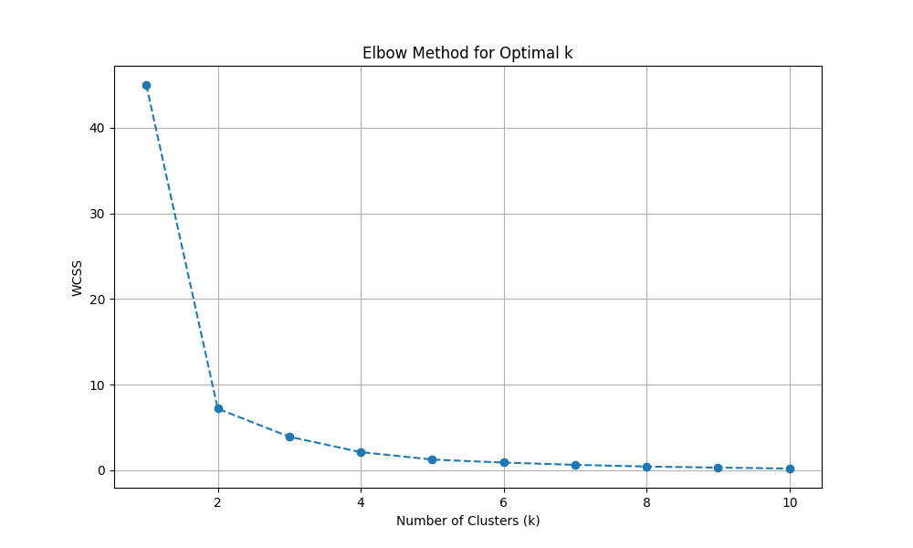
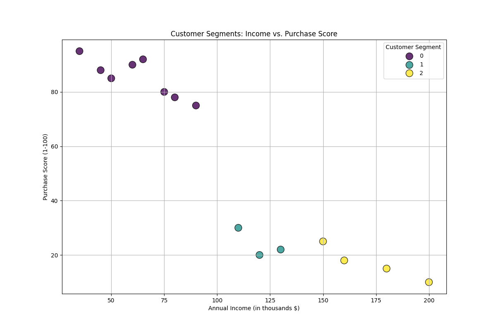

# Сегментація клієнтів (Кластеризація методом к–середніх)

## Метод ліктя (з використанням внутрішньокластерної сума квадратів)

## Дохід і кількість покупок

## Контрольні запитання

### 1. Опишіть задачу розпізнавання образів у термінах пошуку в просторі ознак

Задача розпізнавання образів полягає в тому, щоб автоматично класифікувати об'єкт (зображення, звук, текст) до одного з наперед визначених класів. Розв'язати цю задачу "в лоб", працюючи з сирими даними (наприклад, мільйонами пікселів зображення), є неефективним та обчислювально складним.

Підхід **пошуку в просторі ознак** перетворює цю складну задачу на математичну (геометричну) проблему. Це відбувається у кілька етапів:

1. **Виділення ознак (Feature Extraction):** Замість сирих даних, для кожного образу вимірюються його ключові, вимірювані характеристики — **ознаки**. Наприклад, для розпізнавання літер це можуть бути: кількість прямих ліній, наявність замкнених контурів, співвідношення висоти до ширини. Для звуку — амплітуда, частота, тембр.

2. **Формування простору ознак (Feature Space):** Кожна ознака стає однією з координат (вимірів) у багатовимірному просторі. Таким чином, кожен образ (наприклад, конкретне зображення літери 'А') представляється у вигляді єдиної **точки** (або вектора) в цьому просторі.

3. **Пошук рішення:** Задача розпізнавання тепер зводиться до **пошуку** закономірностей у розташуванні цих точок у просторі ознак.
    * **Для класифікації:** Ми шукаємо **розділяючу поверхню** (лінію, площину або гіперплощину), яка найкращим чином відділяє точки одного класу (наприклад, всі літери 'А') від точок інших класів. Коли з'являється новий, невідомий образ, ми визначаємо його координати в просторі ознак і дивимось, по який бік від цієї поверхні він знаходиться.
    * **Для кластеризації:** Ми шукаємо **природні скупчення (кластери)** точок. Об'єкти, що потрапляють в один кластер, вважаються схожими між собою.

Таким чином, розпізнавання образів перетворюється з аналізу складних об'єктів на пошук геометричних структур та кордонів у математичному просторі.

### 2. В чому полягає суть попередньої обробки образів та вибір ознак для розпізнавання?

Це критично важливий етап, від якого залежить успіх усього процесу розпізнавання. Його суть полягає в принципі "сміття на вході — сміття на виході".

**Попередня обробка образів (Preprocessing):**
Це процес підготовки сирих даних до етапу виділення ознак. Мета — видалити нерелевантну інформацію (шум) і підкреслити важливі характеристики.

* **Приклади для зображень:**
  * **Фільтрація шумів:** Видалення випадкових пікселів, що виникли через погане освітлення або дефекти сенсора.
  * **Нормалізація:** Приведення зображення до стандартного розміру, яскравості, контрастності. Це гарантує, що ознаки не будуть залежати від умов зйомки.
  * **Сегментація:** Виділення об'єкта інтересу з фону.

**Вибір ознак (Feature Selection):**
Це процес відбору найбільш інформативних характеристик, які найкраще допомагають відрізнити один клас об'єктів від іншого.

* **Вимоги до "хороших" ознак:**
  * **Інформативність:** Вони повинні сильно відрізнятися для об'єктів різних класів, але бути схожими для об'єктів одного класу.
  * **Стійкість:** Вони не повинні сильно змінюватися через невеликі спотворення образу (наприклад, невеликий поворот або зміна освітлення).
  * **Низька розмірність:** Чим менше ознак, тим швидше працює алгоритм і тим менше ризик "прокляття розмірності" (ситуації, коли надто велика кількість ознак погіршує якість моделі).

**Суть:** Попередня обробка "чистить" дані, а вибір ознак "фокусує" увагу алгоритму на найважливішому, відкидаючи все зайве.

### 3. Що таке метрики? Які міри метрик ви знаєте?

**Метрика** (або функція відстані) — це функція, яка визначає відстань або ступінь несхожості між двома точками (векторами ознак) у просторі ознак. Це фундаментальне поняття для багатьох алгоритмів машинного навчання, особливо для кластеризації та класифікації методом найближчих сусідів.

Формально, метрика `d(x, y)` повинна задовольняти три умови:

1. `d(x, y) ≥ 0`, і `d(x, y) = 0` тоді й лише тоді, коли `x = y` (невід'ємність).
2. `d(x, y) = d(y, x)` (симетричність).
3. `d(x, z) ≤ d(x, y) + d(y, z)` (нерівність трикутника).

**Найпоширеніші міри метрик:**

* **Евклідова відстань:** Найбільш інтуїтивна — пряма відстань між двома точками.
  * Формула для 2D: `√((x₂ - x₁)² + (y₂ - y₁)²)`
* **Манхеттенська відстань (відстань міських кварталів):** Сума модулів різниць координат. Уявіть, що ви можете рухатися лише вздовж сітки, як по вулицях Манхеттена.
  * Формула для 2D: `|x₂ - x₁| + |y₂ - y₁|`
* **Відстань Чебишова:** Максимальна різниця між координатами.
  * Формула для 2D: `max(|x₂ - x₁|, |y₂ - y₁|)`
* **Косинусна подібність (і відстань):** Вимірює кут між двома векторами. Вона показує подібність напрямків векторів, ігноруючи їхню довжину. Часто використовується для аналізу текстів, де важливіша пропорція слів, а не загальна довжина документа.
  * Косинусна відстань = 1 - Косинусна подібність.

### 4. Які стратегії класифікації ви знаєте? Охарактеризуйте їх

Стратегії класифікації — це різні підходи до побудови розділяючих поверхонь у просторі ознак.

* **Метричні класифікатори:**
  * **Метод k-найближчих сусідів (k-NN):** Клас нового об'єкта визначається голосуванням його `k` найближчих сусідів у просторі ознак. Дуже простий та інтуїтивний, але може бути повільним на великих даних.
* **Імовірнісні класифікатори:**
  * **Наївний Баєсівський класифікатор:** Використовує теорему Баєса для обчислення ймовірності приналежності об'єкта до кожного класу. "Наївний", бо припускає, що всі ознаки є незалежними, що рідко буває правдою, але на практиці працює напрочуд добре, особливо для класифікації текстів (наприклад, спам-фільтри).
* **Лінійні класифікатори:**
  * **Метод опорних векторів (SVM):** Шукає таку розділяючу гіперплощину, яка має максимальний зазор (margin) до найближчих точок кожного класу. Дуже потужний і ефективний.
  * **Логістична регресія:** Моделює ймовірність приналежності до певного класу за допомогою логістичної функції. Незважаючи на назву, це алгоритм класифікації.
* **Логічні (засновані на правилах):**
  * **Дерева рішень (Decision Trees):** Будують ієрархічну структуру правил у вигляді дерева ("якщо... то..."). Легко інтерпретувати, але схильні до перенавчання.
* **Ансамблеві методи:**
  * **Випадковий ліс (Random Forest):** Створює "комітет" з великої кількості незалежних дерев рішень і усереднює їхні прогнози. Це значно підвищує точність і стійкість до перенавчання.

### 5. Опишіть суть методу опорних векторів (SVM – Support Vector Machine)

Суть методу опорних векторів (SVM) полягає в побудові **оптимальної розділяючої гіперплощини** між класами.

* **Що таке гіперплощина?** У 2D-просторі — це лінія, у 3D — площина. У багатовимірному просторі — гіперплощина.
* **Що означає "оптимальна"?** Уявіть, що між двома групами точок можна провести багато різних ліній. SVM шукає ту єдину лінію, яка знаходиться на **максимально можливій відстані** від найближчих точок обох класів. Ця відстань називається **зазором (margin)**.
* **Чому це добре?** Чим більший зазор, тим впевненіше класифікатор може розрізняти об'єкти і тим стійкішим він буде до нових даних.
* **Опорні вектори:** Точки, які знаходяться найближче до гіперплощини і фактично "підпирають" цей зазор, називаються **опорними векторами**. Саме вони визначають положення розділяючої площини. Всі інші точки не впливають на її побудову.
* **"Ядерний трюк" (Kernel Trick):** Якщо дані неможливо розділити лінійно, SVM використовує спеціальні функції (ядра), щоб перетворити простір ознак, "викрививши" його так, щоб у новому, більш високовимірному просторі, дані стали лінійно роздільними.

### 6. Які методи ідентифікації сигналів ви знаєте? Охарактеризуйте їх

Ідентифікація сигналів (наприклад, розпізнавання мови, музики, радіосигналів) використовує декілька підходів:

* **Методи на основі шаблонів (Template Matching):**
  * **Динамічна трансформація часової шкали (DTW - Dynamic Time Warping):** Порівнює невідомий сигнал із набором еталонних шаблонів. DTW дозволяє "розтягувати" або "стискати" сигнал у часі, щоб знайти найкраще співпадіння, навіть якщо слова вимовлені з різною швидкістю. Добре працює для розпізнавання окремих слів або команд.
* **Статистичні методи:**
  * **Приховані Марковські Моделі (HMM - Hidden Markov Models):** Моделюють сигнал як послідовність станів (наприклад, фонем у мові) з певними ймовірностями переходу між ними. Довгий час були стандартом у розпізнаванні мови.
* **Методи машинного навчання:**
  * **Нейронні мережі (Deep Learning):** Сучасний стандарт. Сигнал нарізається на короткі відрізки, для кожного вираховуються ознаки (наприклад, MFCC), які подаються на вхід нейронної мережі (часто згорткової або рекурентної) для класифікації.

### 7. Наведіть ознаки, які можуть використовуватись при розпізнаванні сигналів

Ознаки сигналу виділяють з його представлення у часовій та частотній областях.

* **Часові ознаки (Time-Domain Features):**
  * **Амплітуда:** Гучність сигналу.
  * **Енергія (Root Mean Square - RMS):** Усереднена потужність сигналу.
  * **Частота перетину нуля (Zero-Crossing Rate):** Кількість разів, коли сигнал перетинає нульову вісь. Допомагає відрізнити голосові звуки від шиплячих.
* **Частотні ознаки (Frequency-Domain Features) - отримуються після перетворення Фур'є:**
  * **Спектральний центроїд:** "Центр маси" спектра. Характеризує яскравість або тембр звуку.
  * **Спектральний розмах (Spectral Roll-off):** Частота, нижче якої зосереджена певна частина енергії спектра.
  * **Мел-частотні кепстральні коефіцієнти (MFCC):** Найпопулярніша і найефективніша ознака для розпізнавання мови та музики. Це коефіцієнти, що описують форму спектральної огинаючої, причому шкала частот перетворена так, щоб імітувати людський слух (Мел-шкала).

### 8. Наведіть сфери застосування кластерного аналізу

Кластерний аналіз — це техніка навчання без вчителя, яка знаходить застосування всюди, де потрібно знайти природні групи у нерозмічених даних.

* **Маркетинг:** **Сегментація клієнтів.** Поділ клієнтської бази на групи за поведінкою, демографією, історією покупок для створення цільових рекламних кампаній.
* **Біологія:** Класифікація видів, групування генів зі схожими патернами експресії.
* **Обробка зображень:** **Сегментація зображень** (групування пікселів за кольором або текстурою для виділення об'єктів), пошук схожих зображень.
* **Аналіз текстів:** Групування новинних статей за темами, виявлення основних тем у відгуках клієнтів.
* **Фінанси:** Виявлення шахрайських транзакцій (вони часто утворюють окремий, нетиповий кластер), сегментація акцій за їхньою поведінкою на ринку.
* **Медицина:** Групування пацієнтів зі схожими симптомами для діагностики захворювань.
* **Геоінформаційні системи (GIS):** Визначення міських зон (житлових, промислових, комерційних) на основі даних про будівлі та активність.

### 9. Які алгоритми кластеризації даних ви знаєте? Охарактеризуйте їх

Алгоритми кластеризації відрізняються підходом до того, що саме вони вважають "кластером".

* **Методи, що базуються на центроїдах (Centroid-based):**
  * **K-Means (k-середніх):** Найпопулярніший алгоритм. Розбиває дані на `k` кластерів. Кожен кластер визначається його центром (центроїдом). Алгоритм прагне мінімізувати сумарну квадратичну відстань (WCSS) від точок до центроїдів їхніх кластерів.
    * *Переваги:* Швидкий, простий.
    * *Недоліки:* Потрібно заздалегідь знати кількість кластерів `k`, чутливий до початкових центрів, погано працює з кластерами некулястої форми.
* **Ієрархічні методи (Hierarchical):**
  * **Агломеративна кластеризація:** Підхід "знизу вгору". Спочатку кожна точка є окремим кластером. На кожному кроці два найближчі кластери об'єднуються, поки не залишиться один великий кластер. Результат можна представити у вигляді дендрограми (дерева), яку можна "зрізати" на будь-якому рівні, щоб отримати потрібну кількість кластерів.
    * *Переваги:* Не вимагає знання `k` наперед, дає візуальне представлення.
    * *Недоліки:* Обчислювально складний для великих даних.
* **Методи, що базуються на щільності (Density-based):**
  * **DBSCAN:** Визначає кластери як області високої щільності точок, відокремлені областями низької щільності.
    * *Переваги:* Може знаходити кластери довільної форми, автоматично визначає викиди (шум).
    * *Недоліки:* Не дуже добре працює з кластерами різної щільності.

## Джерела

1. <https://aistudio.google.com/app/prompts?state=%7B%22ids%22:%5B%221h3sJM-wyZ7ycxYz_x-T0SgyGjUZbsrF_%22%5D,%22action%22:%22open%22,%22userId%22:%22104200205768650044534%22,%22resourceKeys%22:%7B%7D%7D&usp=sharing>
