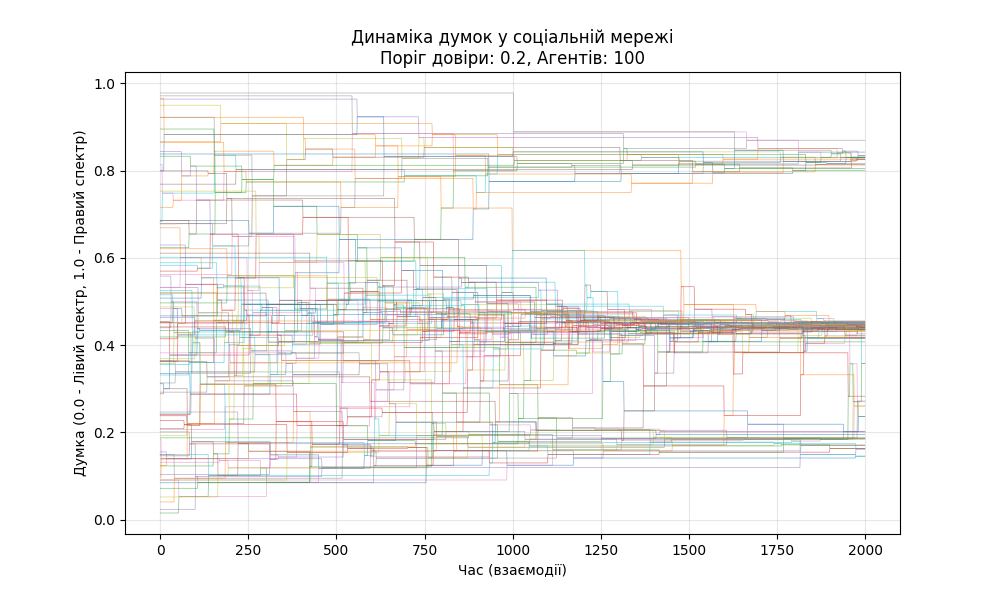

# Лабораторна робота №10: Багатоагентні системи. Варіант 13: Моделювання поведінки соціальних мереж (Динаміка думок)

## 1. Постановка задачі та структура системи

Ми моделюємо соціальну мережу, де агенти — це користувачі, які обмінюються думками з певної теми (наприклад, політичні погляди). Ми використовуємо модель обмеженої довіри (Bounded Confidence Model), або модель Деффуанта. Вона показує, як суспільство приходить до згоди (консенсусу) або розколюється на полярні групи («ехо-камери»), де люди чують тільки тих, хто з ними згоден.

### Структура MAS (Multi-Agent System)

1. **Агенти (Користувачі):**
    * Кожен агент $i$ має внутрішній стан — **думку** ($x_i$), яка є дійсним числом від 0.0 (крайні ліві погляди) до 1.0 (крайні праві погляди).
    * Агенти автономні і на кожному кроці обирають співрозмовника випадковим чином.

2. **Середовище (Соціальний граф):**
    * Для спрощення вважаємо, що граф повний (кожен може потенційно зустріти кожного), або випадковий.

3. **Правила взаємодії (Протокол):**
    * Два агенти ($i$ та $j$) зустрічаються.
    * **Перевірка довіри:** Якщо різниця їхніх думок $|x_i - x_j|$ менша за поріг довіри $\epsilon$ (epsilon), вони впливають один на одного. Якщо різниця занадто велика (вони кардинально не згодні), вони ігнорують один одного.
    * **Зміна думки:** Якщо довіра є, вони зсувають свої погляди назустріч один одному на коефіцієнт зближення $\mu$.

    $$x_i(t+1) = x_i(t) + \mu \cdot (x_j(t) - x_i(t))$$
    $$x_j(t+1) = x_j(t) + \mu \cdot (x_i(t) - x_j(t))$$

## 2. Реалізація (Python)

Використаємо Python та бібліотеку `matplotlib` для візуалізації того, як змінюються думки агентів з часом.

Графік:

1. **Вісь X** — це час.
2. **Вісь Y** — це спектр думок (0 — один полюс, 1 — інший).
3. **Лінії** — це життя кожного агента.

    > Оскільки лінії розійшлися на кілька пучків і не перетинаються — це Поляризація (Ехо-камери). Люди з різних груп перестали чути одне одного.

## 3. Відповіді на контрольні запитання

**1. Дайте визначення багатоагентної системи (БАС). У чому її особливість?**
Багатоагентна система — це система, утворена кількома взаємодіючими інтелектуальними агентами, які знаходяться в певному середовищі.

* **Особливість:** Відсутність єдиного центру керування (децентралізація). Кожен агент діє автономно, виходячи з локальної інформації та власних цілей, але їхня сукупна взаємодія призводить до вирішення глобальної задачі або виникнення складного феномену (емерджентність).

**2. Наведіть приклади застосування багатоагентних систем для рішення задач штучного інтелекту.**

* **Логістика:** Агенти-вантажівки домовляються про маршрути для мінімізації заторів.
* **Smart Grid (Розумні енергомережі):** Агенти-лічильники торгуються за ціну електроенергії з агентами-генераторами для балансування навантаження.
* **Комп'ютерні ігри:** NPC (неігрові персонажі), що координують атаку на гравця.
* **Торгівля на біржі:** Агенти-боти, що автоматично купують/продають акції.

**3. Охарактеризуйте «Ройовий інтелект» (Swarm intelligence) та наведіть алгоритми.**
Ройовий інтелект — це поведінка системи децентралізованих агентів, яка виглядає розумною, хоча кожен окремий агент примітивний. Інтелект "народжується" з їхньої взаємодії.

* *Приклад:* Мурахи не знають геометрії, але колонія знаходить найкоротший шлях до їжі.
* *Алгоритми:*
  * **Ant Colony Optimization (ACO):** Мурашиний алгоритм.
  * **Particle Swarm Optimization (PSO):** Метод рою частинок (імітація зграї птахів).
  * **Artificial Bee Colony (ABC):** Бджолиний алгоритм.

**4. Опишіть мурашині алгоритми (ACO – Ant Colony Optimization).**
Це клас алгоритмів, натхненний поведінкою мурах при пошуку їжі.

* **Суть:** Мурахи блукають випадково. Знайшовши їжу, вони повертаються до мурашника, залишаючи слід феромонів. Інші мурахи з більшою ймовірністю йдуть туди, де феромонів більше.
* Коротший шлях проходиться швидше -> там встигає пройти більше мурах -> там накопичується більше феромонів -> шлях стає основним.
* Використовується для задачі комівояжера, маршрутизації в інтернеті.

**5. Опишіть суть та сферу застосування групової робототехніки.**
Групова робототехніка (Swarm Robotics) вивчає координацію великої кількості простих роботів.

* **Суть:** Замість одного складного і дорогого робота використовується сотня дешевих і простих. Якщо один зламається — місія не провалена.
* **Застосування:** Пошуково-рятувальні роботи (прочісування місцевості), дослідження Марса, будівництво структур, сільське господарство (запилення).

**6. Яким чином можна використати багатоагентний підхід в системах керування?**
Для підвищення надійності та гнучкості.

* **Приклад (Світлофори):** Замість центрального комп'ютера міста, кожен світлофор є агентом. Він "бачить" чергу машин перед собою і домовляється з сусідніми світлофорами про "зелену хвилю". Це адаптується до аварій краще за жорсткий розклад.

**7. Які ви знаєте платформи для розробки багатоагентних систем?**

* **Mesa (Python):** Сучасна, легка бібліотека для агентного моделювання (використовується дата-сайєнтистами).
* **NetLogo:** Найпопулярніше середовище для навчання. Має власну просту мову, ідеальну для візуалізації.
* **JADE (Java Agent Development Framework):** Промисловий стандарт для створення розподілених агентних систем, підтримує стандарти FIPA.
* **AnyLogic:** Потужний комерційний інструмент для імітаційного моделювання.
